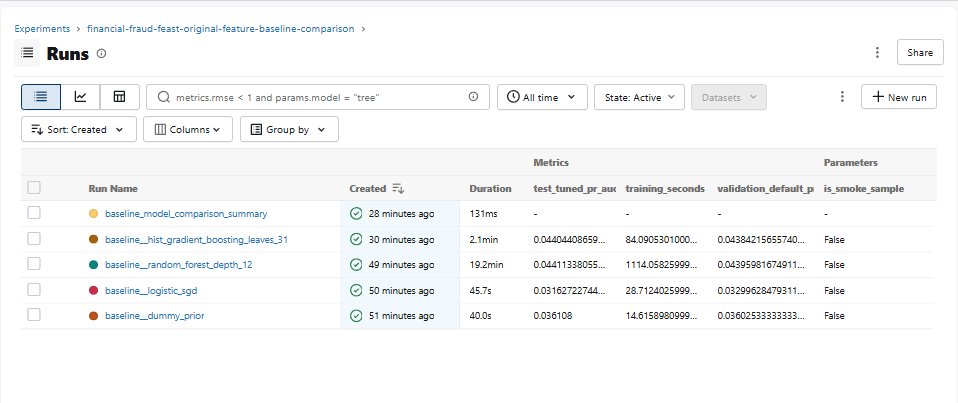
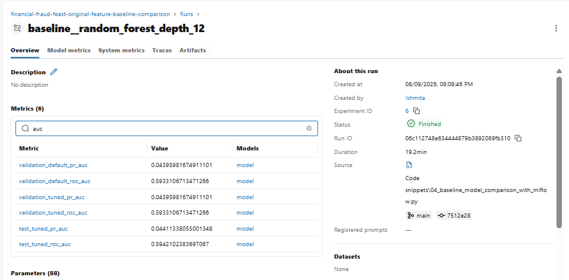
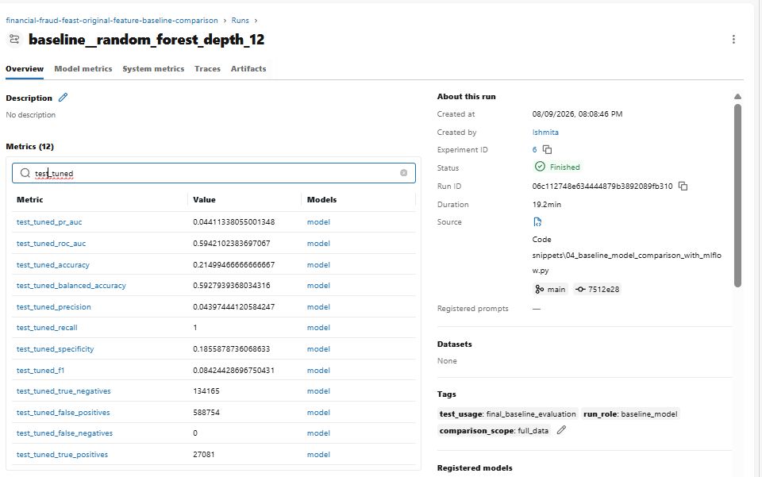
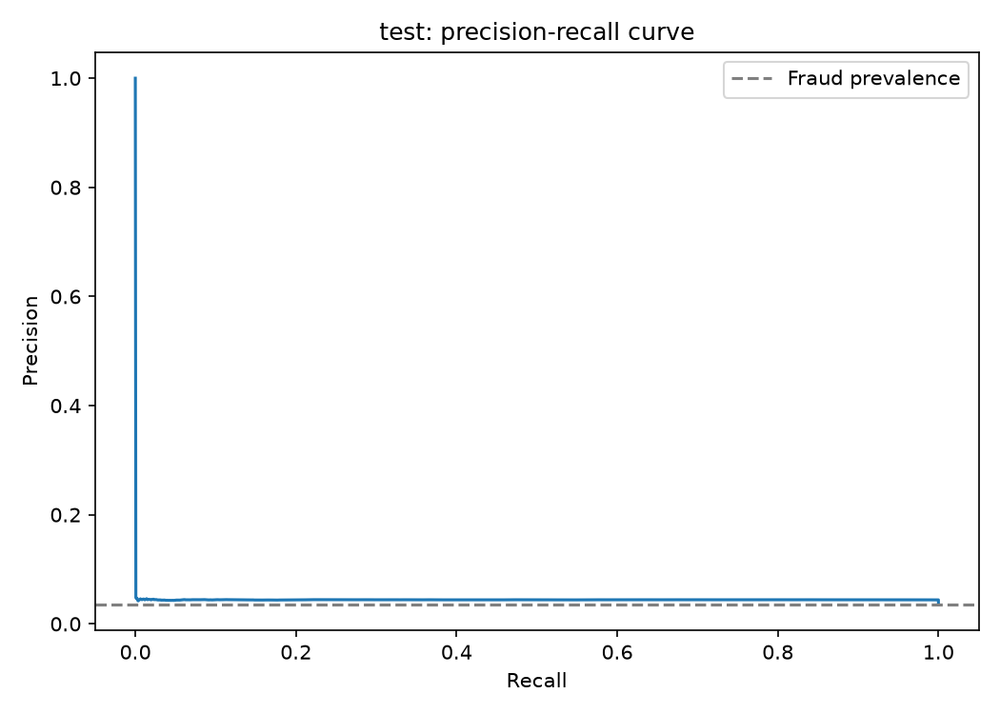
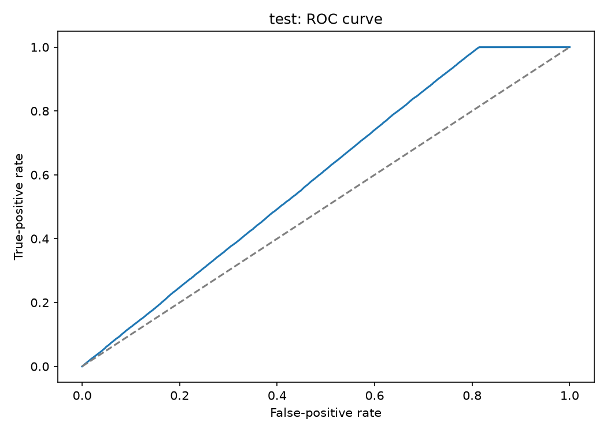
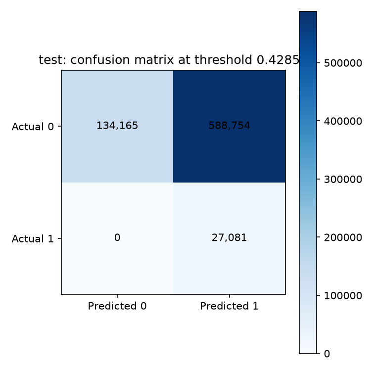

# Baseline model development: full-data results

The baseline experiment was completed on 29 July 2026 using the full five-million-row transaction dataset. It compares three trainable model families and a prior-only reference before any feature engineering or hyperparameter search is introduced.

The purpose of this stage is to answer a limited but important question: how much predictive structure can the original cleaned variables provide under a consistent, out-of-time evaluation? The answer becomes the reference for later development. It does not, by itself, justify registering or deploying a model.

Results are stored in MLflow experiment <code>financial-fraud-feast-original-feature-candidate-models</code>. The comparison summary is run <code>aa97d03ab72147ed91a834d29335dc27</code>.

These recorded v1 runs predate the consolidation into <code>04_baseline_model_comparison_with_mlflow.py</code>, so their experiment and run names retain the legacy word <code>candidate</code>. The fixed configurations, metrics, artifacts, and run IDs remain the canonical evidence for this baseline result; new executions use baseline-comparison naming.

## Models and the reasoning behind them

The trainable baseline configurations are Logistic SGD, Random Forest, and Histogram Gradient Boosting. A prior-only Dummy Classifier is included as a non-skill reference rather than counted as a fourth trainable model.

Logistic SGD provides the linear reference. Although the EDA found almost no direct linear correlation between individual numerical predictors and fraud, several weak variables might still carry information when combined. An SGD-based logistic model can test this possibility efficiently on five million rows and provides coefficients that are easier to interpret than a tree ensemble.

Random Forest tests whether fraud depends on nonlinear thresholds and interactions. This is plausible because the EDA showed possible structure across amount groups and combinations of anomaly scores even when individual correlations were weak. Combining many trees also gives a more stable nonlinear comparison than relying on a single Decision Tree.

Histogram Gradient Boosting offers a second nonlinear ensemble with a different learning strategy. It builds trees sequentially and uses compact ordinal categorical preprocessing, which avoids creating a very large dense one-hot matrix. This makes it particularly attractive for a large tabular dataset.

The Dummy Classifier returns the training-set fraud prior without learning predictor–target relationships. Since only about 3.59% of transactions are fraudulent, it exposes why ordinary accuracy is an inadequate baseline metric.

## Data lineage and original feature set

The modeling table was retrieved from the local Feast service <code>fraud_model_features_v1</code>. Feast joined versioned prediction-time features with the separate label file, and the resulting table was validated before the experiment began.

| Item | Recorded value |
| --- | --- |
| Feature version | <code>v1</code> |
| Entity and join key | <code>transaction</code> / <code>transaction_id</code> |
| Event-time field | <code>event_timestamp</code> |
| Target | <code>is_fraud</code> |
| Total transactions | 5,000,000 |
| Fraud cases | 179,553 |
| Overall fraud rate | 3.59106% |
| Random state | 42 |

The exact feature and label artifacts are identified by their SHA-256 hashes:

~~~text
Feature table:
db1c01acc7c6425113a4d8d41df753f4c9fc49b5c1a0c37479cc258ac4e5354c

Label table:
72e3a80f04d6d1bf917bd88588b7bc9820c39c703acdd8496ea136ec7e8f8e78
~~~

No engineered feature was used. The predictors were transaction type, merchant category, location, device, payment channel, amount, time since the previous transaction, spending-deviation score, velocity score, and geographic-anomaly score. The transaction ID was kept only for lineage, the timestamp only for ordering, and <code>is_fraud</code> only as the target. The label-derived <code>fraud_type</code> field was excluded because it would reveal the outcome.

## Out-of-time evaluation design

Transactions were sorted by event time. The oldest 70% formed the training set, the next 15% the validation set, and the newest 15% the test set.

| Split | Rows | Fraud cases | Fraud rate | Period |
| --- | ---: | ---: | ---: | --- |
| Train | 3,500,000 | 125,453 | 3.5844% | 1 January to 14 September 2023 |
| Validation | 750,000 | 27,019 | 3.6025% | 14 September to 7 November 2023 |
| Test | 750,000 | 27,081 | 3.6108% | 7 November 2023 to 1 January 2024 |

This design approximates the intended use of older transactions to classify newer ones. All learned preprocessing—including imputation, encoding, and scaling—was fitted inside the model pipeline using training data.

For each model, validation scores were used to select the threshold that maximized F1. The chosen threshold was then applied unchanged to the test period. The preferred model was selected by validation PR-AUC, not by any test metric.

The implementation logs scikit-learn Average Precision under the name <code>pr_auc</code>. In the thesis, it should be described precisely as **Average Precision, used as the summary measure of the precision–recall curve**.

## MLflow experiment overview

*Figure 1. The four full-data runs shown with validation PR-AUC, test PR-AUC, training time, and run status.*

## Results

| Model | Role | Validation PR-AUC | Validation ROC-AUC | Precision at selected threshold | Recall | F1 |
| --- | --- | ---: | ---: | ---: | ---: | ---: |
| Dummy prior | Non-skill reference | 0.036025 | 0.500000 | 0.036025 | 1.000000 | 0.069545 |
| Logistic SGD | Linear baseline | 0.032996 | 0.469898 | 0.036032 | 0.999778 | 0.069558 |
| Random Forest | Nonlinear ensemble | **0.043960** | **0.593311** | **0.043893** | **0.999038** | **0.084091** |
| Histogram Gradient Boosting | Boosted nonlinear ensemble | 0.043842 | 0.592690 | 0.043868 | 0.996410 | 0.084036 |

The chronological test results at the validation-selected thresholds were:

| Model | Test PR-AUC | Test ROC-AUC | Precision | Recall | F1 | Threshold | Training time |
| --- | ---: | ---: | ---: | ---: | ---: | ---: | ---: |
| Dummy prior | 0.036108 | 0.500000 | 0.036108 | 1.000000 | 0.069699 | 0.035844 | 18.55 s |
| Logistic SGD | 0.031627 | 0.459112 | 0.036089 | 0.998634 | 0.069660 | 0.427277 | 34.46 s |
| Random Forest | **0.044113** | **0.594210** | **0.043974** | **1.000000** | **0.084244** | 0.428590 | 1,124.03 s |
| Histogram Gradient Boosting | 0.044044 | 0.593752 | 0.043971 | 0.999668 | 0.084237 | 0.272284 | 91.31 s |

## Interpreting the comparison

The logistic model did not improve on the dummy reference. Its validation PR-AUC was 0.032996, below the validation fraud prevalence of 0.036025, and its ROC-AUC was below 0.5. Under this configuration, a linear decision surface does not capture useful separation in the original feature set. This result supports testing nonlinear relationships, but it should not be generalized to every possible linear specification.

Both nonlinear ensembles improved on the reference. Random Forest achieved the highest validation PR-AUC at 0.043960, while Histogram Gradient Boosting reached 0.043842. The difference—approximately 0.000118—is small. Training cost, however, differed substantially: Random Forest required about 1,124 seconds, compared with about 91 seconds for Histogram Gradient Boosting.

Under the predefined validation PR-AUC rule, Random Forest becomes the original-feature benchmark. The result also shows why the highest metric should not be read without context: Histogram Gradient Boosting produced almost the same ranking quality much more quickly.

The selected Random Forest run is:

~~~text
Legacy run name: candidate__random_forest_depth_12
Run ID: 8163be867bd94281946f2e5f5490fc0f
~~~

*Figure 2a. Validation and test PR-AUC and ROC-AUC for the selected Random Forest run.*

*Figure 2b. Test precision, recall, specificity, and F1 at the threshold selected on validation data.*

## Ranking quality and operating behavior

On the test period, Random Forest achieved Average Precision of 0.044113 against a fraud prevalence of 0.036108. Its ROC-AUC was 0.594210. These values indicate better-than-random ranking, but the separation between fraudulent and legitimate transactions remains weak.

*Figure 3. Test precision–recall curve. The horizontal reference marks fraud prevalence in the test period.*

*Figure 4. Test ROC curve compared with the diagonal non-skill reference.*

The confusion matrix makes the operational limitation clearer:

| Actual class | Predicted legitimate | Predicted fraud |
| --- | ---: | ---: |
| Legitimate | 134,165 | 588,754 |
| Fraud | 0 | 27,081 |

The selected threshold found every fraud case in this test split, giving recall of 1.0. It also marked 588,754 legitimate transactions as fraud. Altogether, 615,835 of 750,000 transactions—about 82.1%—would require investigation.

*Figure 5. Test confusion matrix at the validation-F1-maximizing threshold.*

This is not an operationally acceptable result. It illustrates why recall or F1 cannot be considered separately from false-positive volume and investigation capacity. The next development stage must improve ranking quality and evaluate thresholds against an explicit cost model or alert budget.

## Reproducibility evidence

MLflow stores the model and preprocessing parameters, data-source hashes, Feast version and service, split boundaries and class balance, validation and test metrics, threshold information, timings, diagnostic figures, environment versions, source snapshots, feature names, model signatures, input examples, and fitted pipelines.

The full-data run IDs are:

| Run | MLflow run ID |
| --- | --- |
| Dummy prior | <code>3a597b2efe6342d5805739f04acf2415</code> |
| Logistic SGD | <code>fdbc69c89c6b4903981aefdf7900532c</code> |
| Random Forest | <code>8163be867bd94281946f2e5f5490fc0f</code> |
| Histogram Gradient Boosting | <code>e631739c19fb4a2f85fe7ccd10a94339</code> |
| Comparison summary | <code>aa97d03ab72147ed91a834d29335dc27</code> |

This evidence supports the MLOps-DSPM activities DP09 model selection, DP10 model development, and DP11 model evaluation. The fixed protocol and recorded environment support NF05 scientific methods, while the connection among data lineage, code, parameters, metrics, artifacts, and fitted models supports NF07 traceability.

## Conclusion and remaining checkpoint work

The experiment establishes a reproducible original-feature benchmark. Nonlinear ensembles use the available variables more effectively than the tested linear model, and Random Forest ranks first under the predefined validation rule. Histogram Gradient Boosting remains an important near-equivalent because it trains much faster.

Absolute performance is still modest, and the F1-selected Random Forest threshold creates an impractical false-positive burden. The model is therefore retained only as a benchmark. It has not received a champion alias and should not be registered for deployment.

Before closing this checkpoint, the calculations and wording should be reviewed against the MLflow interface, a commit identifier should be recorded once the source is committed, and any supervisor feedback should be added with its review date.
